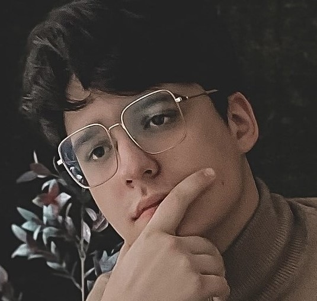

# Goncharov Gleb
# Junior FrontEnd Developer

### Contacts:
* **Telegram:** @avvogg55
* **Email:** avvogg55@gmail.com
* **Tel:** +375292537020
### About me:
  I want to become a FrontEnd Developer.
  I am sociable, with a sense of humor, as diligent and responsible. I have a lot of free time and desire to study. Talking about my perspectives and wishes, i really want to earn some experience and introduce Game Development.
  On my opinion programming is creating something new, like every project is a little world which developers are build. This is awesome, i'd like to be one of this creators!
### Skills:
  Java Core, SQL, Git, Spring MVC,
  HTML, Intellij IDEa, VS Code
### Code examples:
  [Simple Console Java Game](https://github.com/avvogg55/RPGGame)

  [Application which imitates work of ATM](https://github.com/avvogg55/ATMProject)
### Aducation:
  BNTU Civil Engineering Faculty 2018-2022
  civil engineer - technologist

  Java BackEnd Course 2021-2022

  Engineering English Courses 2018-2019
### English level:
  B2